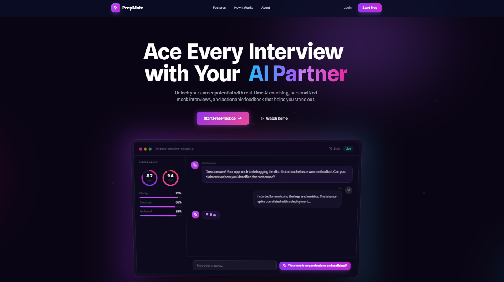

<div align="center">

# 🎯 PrepMate

**Your AI-Powered Interview Partner**

Practice interviews • Get instant feedback • Land your dream job

[](https://prepmate-interview.vercel.app/)
[](https://nextjs.org/)
[](https://www.typescriptlang.org/)

</div>

---

## 📸 Preview

<div align="center">
  
</div>

---

## ✨ Features

- 🤖 **AI-Powered Practice** - Realistic interview questions using Google Gemini AI
- 📊 **Instant Feedback** - Detailed analysis and improvement suggestions
- 📈 **Progress Tracking** - Monitor your improvement over time
- 🎯 **All Interview Types** - Technical, Behavioral, HR, System Design
- 💰 **100% Free** - No hidden costs, unlimited practice
- ⚡ **24/7 Available** - Practice anytime, anywhere

---

## 🚀 Tech Stack

- **Frontend:** Next.js 14, TypeScript, Tailwind CSS, Framer Motion
- **Backend:** Next.js API Routes, Supabase (PostgreSQL)
- **AI:** Google Gemini API, Groq API
- **Auth:** Clerk
- **Storage:** Vercel Blob, Cloudinary
- **Deployment:** Vercel

---

## 🛠️ Quick Start

1. **Clone the repo**
```bash
git clone https://github.com/Sujal-tyagi17/PrepMate.git
cd prepmate
```

2. **Install dependencies**
```bash
npm install
```

3. **Set up environment variables**

Create `.env.local`:
```env
# Clerk
NEXT_PUBLIC_CLERK_PUBLISHABLE_KEY=your_key
CLERK_SECRET_KEY=your_secret
NEXT_PUBLIC_CLERK_SIGN_IN_URL=/sign-in
NEXT_PUBLIC_CLERK_SIGN_UP_URL=/sign-up
NEXT_PUBLIC_CLERK_AFTER_SIGN_IN_URL=/dashboard
NEXT_PUBLIC_CLERK_AFTER_SIGN_UP_URL=/dashboard

# AI APIs
GEMINI_API_KEY=your_key
GROQ_API_KEY=your_key

# Supabase
NEXT_PUBLIC_SUPABASE_URL=your_url
NEXT_PUBLIC_SUPABASE_ANON_KEY=your_key

# Cloudinary
NEXT_PUBLIC_CLOUDINARY_CLOUD_NAME=your_name
CLOUDINARY_API_KEY=your_key
CLOUDINARY_API_SECRET=your_secret

# App URL
NEXT_PUBLIC_APP_URL=http://localhost:3000
```

4. **Run development server**
```bash
npm run dev
```

Open [http://localhost:3000](http://localhost:3000)

---

## 📁 Project Structure
```
prepmate/
├── app/                 # Next.js app directory
│   ├── (auth)/         # Authentication pages
│   ├── (dashboard)/    # Protected routes
│   └── api/            # API routes
├── components/          # React components
├── lib/                # Utilities (AI, DB, Storage)
├── public/             # Static assets
└── types/              # TypeScript types
```

---

## 🚢 Deployment

Deploy to Vercel:

1. Push your code to GitHub
2. Go to [Vercel](https://vercel.com/)
3. Import your repository
4. Add environment variables
5. Deploy!

Or use Vercel CLI:
```bash
npm i -g vercel
vercel
```

---

## 🎯 Usage

1. **Sign Up** - Create account or sign in with Google/GitHub
2. **Choose Interview Type** - Technical, Behavioral, HR, or System Design
3. **Practice** - Answer AI-generated questions via voice or text
4. **Get Feedback** - Review detailed performance analysis
5. **Track Progress** - Monitor improvement over time
---

## 👤 Author

**Sujal Tyagi**

- GitHub: [@Sujal-tyagi17](https://github.com/Sujal-tyagi17)
- Email: tyagisujal007@gmail.com

---

## 🙏 Acknowledgments

- [Next.js](https://nextjs.org/) for the amazing framework
- [Google Gemini](https://ai.google.dev/) for AI capabilities
- [Vercel](https://vercel.com/) for hosting
- [Clerk](https://clerk.com/) for authentication

---

<div align="center">

⭐ **Star this repo if you find it helpful!**

</div>